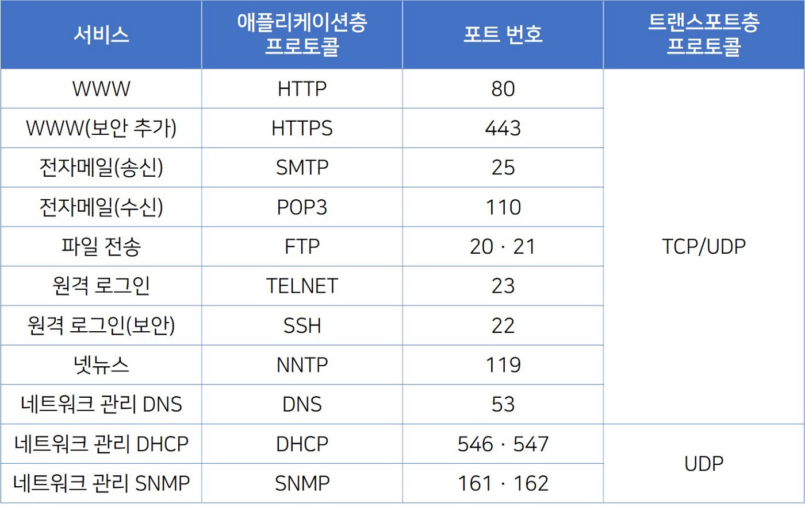
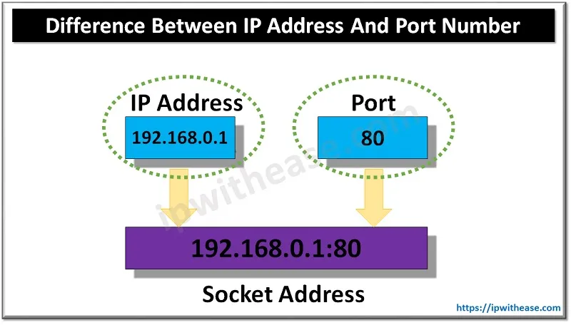
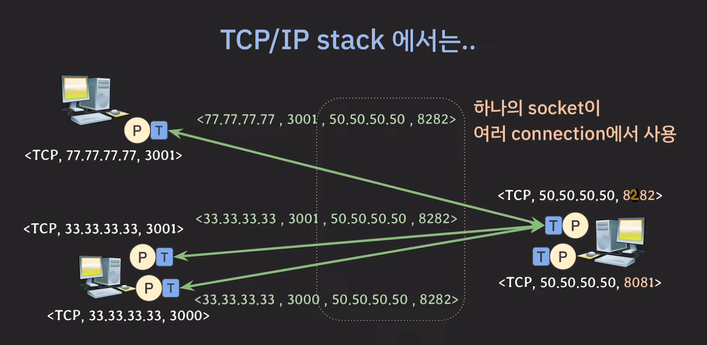

# 포트(Port)란?

- **정의:** 포트는 네트워크를 통해 컴퓨터가 서로 통신할 때 특정 프로그램이나 서비스를 식별하는 논리적인 장소입니다.

- **역할:** 여러 네트워크 서비스나 프로그램들이 동시에 통신할 수 있도록 각각을 구분해 주는 역할을 합니다.

- **예시:** 웹 서버는 주로 80번(HTTP) 또는 443번(HTTPS) 포트를 사용합니다. 이메일 서버는 25번(SMTP) 또는 110번(POP3) 포트를 사용할 수 있습니다.

- **종류:** 일반적으로 잘 알려진 포트(0-1023), 등록된 포트(1024-49151), 동적 또는 개인 포트(49152-65535)로 구분됩니다.

# 소켓(Socket)이란?

- **정의:** 소켓은 네트워크에서 데이터를 주고받기 위한 끝점(endpoint)을 의미합니다. 네트워크 상에서 통신을 하기 위한 인터페이스 역할을 합니다.

- **역할:** 소켓은 네트워크 통신의 기본 단위로, IP 주소와 포트 번호의 조합으로 구성됩니다. 이를 통해 특정 서버의 특정 서비스에 접근할 수 있습니다.

- **종류:** 가장 일반적인 소켓 유형은 TCP(Transmission Control Protocol) 소켓과 UDP(User Datagram Protocol) 소켓입니다. TCP는 연결 지향적이고 신뢰할 수 있는 통신을 제공하는 반면, UDP는 연결이 없고 빠른 통신을 제공합니다.

- **사용 예시:** 웹 브라우저가 웹 서버에 연결할 때 TCP 소켓을 사용합니다. 온라인 게임이나 스트리밍 서비스에서는 실시간성이 중요하기 때문에 UDP 소켓을 사용하는 경우가 많습니다.

