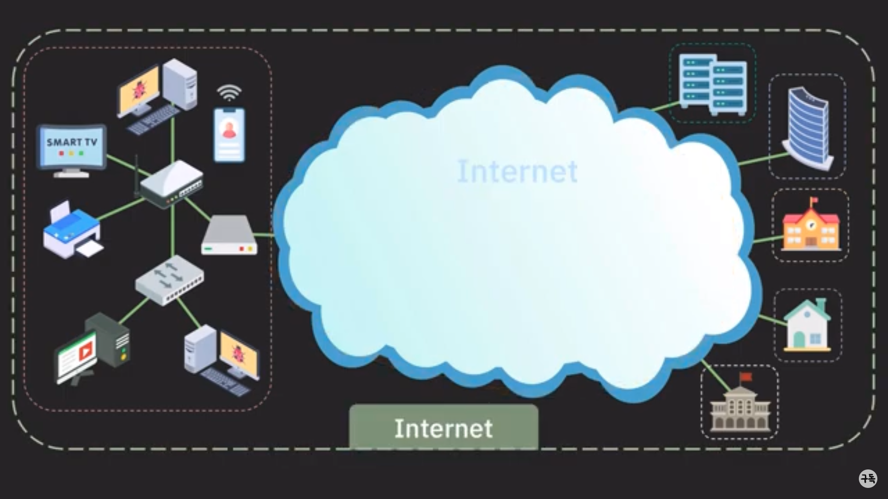
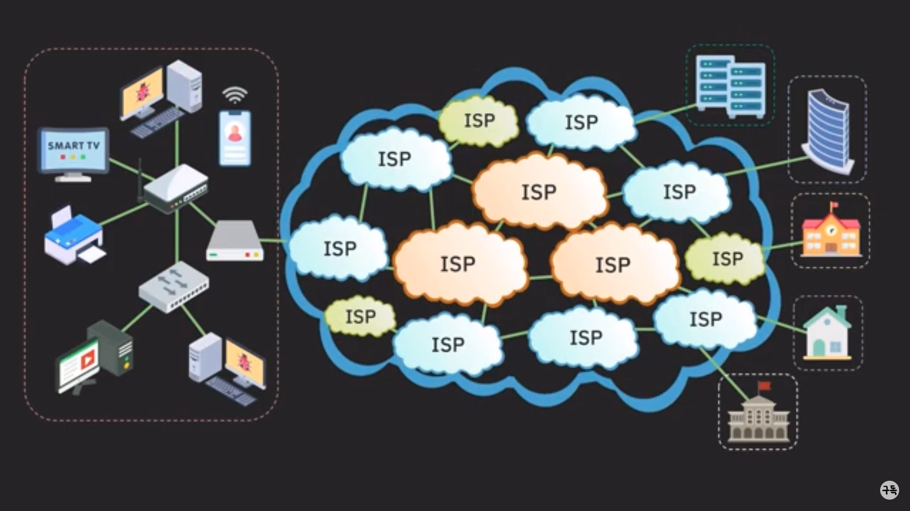
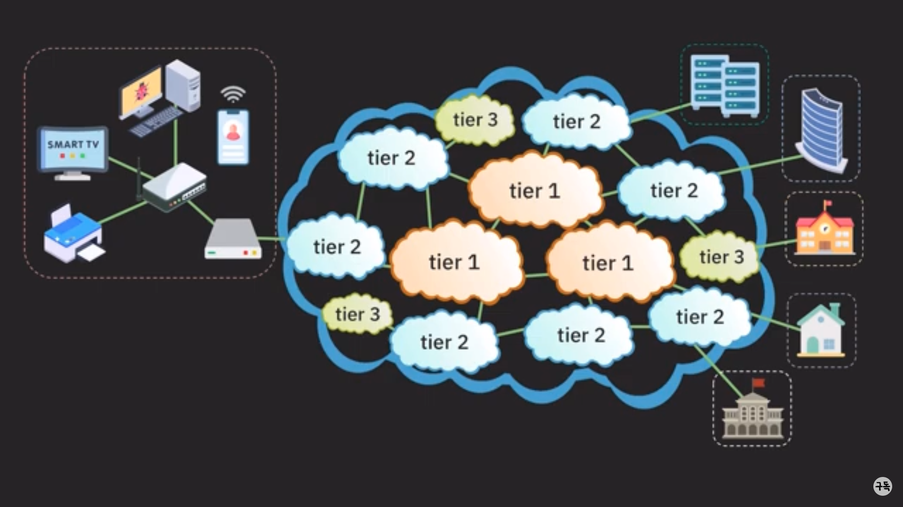
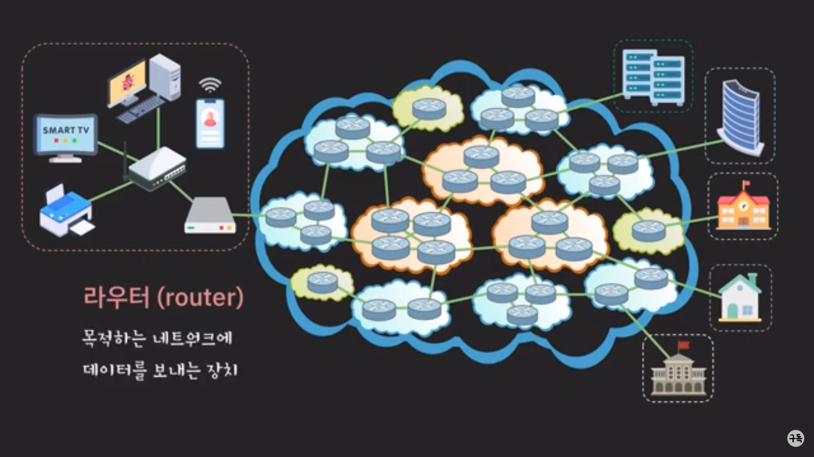

# 네트워크란?

**컴퓨터나 기타 기기들이 리소스를 공유하거나 데이터를 주고 받기 위해 유선 혹은 무선으로 연결된 통신 체계**
네트워크란 물리적 전송 매체를 사용해 서로 연결된 장치 집합으로 정의됩니다. 예를 들어 컴퓨터 네트워크는 하드웨어, 데이터 및 소프트웨어와 같은 정보와 리소스를 통신하고 공유하기 위해 서로 연결된 컴퓨터 그룹입니다.

## 네트워크의 종류는?

**LAN, WAN, 인터넷이 있습니다.**

- LAN(인트라넷)은 비교적 좁은 공간인 학교, 기업, 연구소 등의 컴퓨터 끼리 이어 구성한 네트워크를 말하고, 구리선을 짜넣은 LAN 케이블을 사용한다.
  이더넷 (유선통신)과 와이어리스랜 (무선통신/Wi-fi) 입니다.
- WAN은 지리적으로 떨어져 있는 기기 끼리 연결한 비교적 대규모의 네트워크를 말하며, 광섬유 케이블이나, 회선을 이용한다.
  은행의 ATM, wireless WAN( 4G,5G ), Internet

# 인터넷이란 LAN, WAN을 연결한 전세계 규모의 네트워크이다.

**모뎀 (modem)** : 네트워크 통신에 필요한 신호 변환 장치

**공유기 (home router)** : 여러 기기들을 인터넷에 연결될 수 있도록 하는 장치, 하나의 IP 주소로도 동시에 인터넷을 사용하는 것이 가능, 공유기에 연결된 기기들은 같은 네트워크 소속

**스위치 (switch)** : 같은 네트워크 내의 기기들이 서로 통신할 수 있도록 하는 장치, 보통 공유기의 랜(Lan) 포트 수가 부족할 때 사용, 스위칭 허브 혹은 그냥 허브라고도 불림

**ISP (internet service provider)** : 일반 사용자나 회사, 기관 등이 인터넷을 사용할 수 있도록 인터넷 연결 서비스를 제공하는 존재
(SK 브로드밴드, KT , LG U+)

**tier 1** : **_국제 범위의 네트워크 보유 / 인터넷의 모든 네트워크 접급 가능 / 인터넷 중추 역할 (backbone) / 트래픽 전송 비용 없음_**
가장 높은 등급은 Tier-1으로 17개 ISP가 이에 속해있다. 대표적으로 미국의 AT&T, Verizon, Sprint 등이 있다.

**tier 2** : **_국가,지방 범위 네트워크 보유 / 일반 사용자나 기업 대상 서비스 / 인터넷의 모든 영역에 연결되기 위해 tier 1 ISP에 비용을 내고 트랙픽 전송 (망 중립성과 관련된 부분)_**
SK 브로드밴드와 KT가 여기에 속한다.
Tier-2 ISP는 Tier-1 ISP의 고객인 셈이다.

**tier 3** : **_작은 지역 범위 서비스 제공 / 일반 사용자나 기업 대상 서비스 / 상위 ISP에게 비용을 내고 인터넷 트래픽을 구매해서 이를 통해 서비스 (미국 같은 땅이 넓은 지역)_**
Tier-2 보다 작은 인터넷 사업자에 해당하는 Tier-3 ISP도 존재한다. LG U+가 여기에 속한다.

**노드 ( node )** : 네트워크를 구성하는 장치(device) 통틀어서 노드 라고 부릅니다. ( 컴퓨터, 라우터, 모뎀, 스위치 )

**End system, 호스트(host)** : 네트워크의 끝에 있는 노드 / 네트워크를 사용하기 위해 연결된 노드 / 클라이언트와 서버로 나뉨

**클라이언트 (client)** : 다른 호스트의 데이터나 리소스를 요청하는 호스트

**서버 (server)** : 다른 호스트에게 서비스를 제공하는 호스트 / 요청에 따라 데이터나 리소스를 제공
